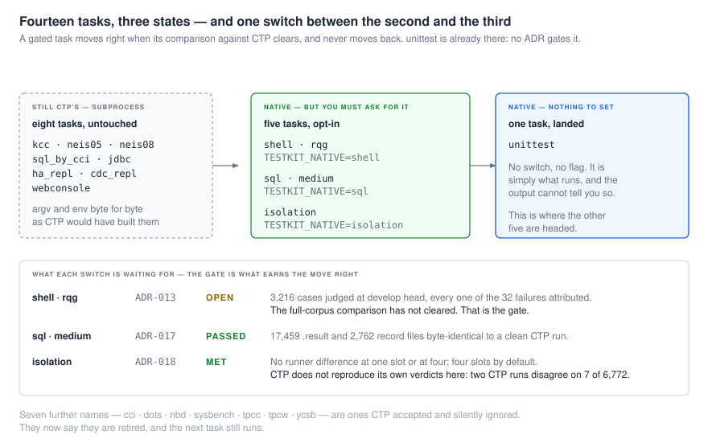
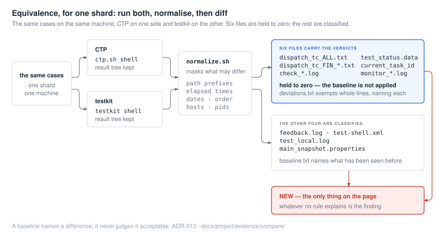

*[English](README.md) · 한국어*

**cubrid-testkit** 은 CUBRID 의 기능 테스트를 돌린다. 케이스를 찾고, 엔진에 대해 실행하고,
각각이 통과했는지 판정하고, 무슨 일이 있었는지 적는다 — 그리고 그 외에는 아무것도 하지 않는다.

CTP 의 `bin/ctp.sh` 를 그 자리에서 대체한다: 같은 task 이름, 같은 설정 키, 같은 stdout 마커,
같은 결과 파일, 같은 종료 코드. Go 로 다시 쓴 task 는 여기서 돌고, 나머지는 원본 CTP 에
서브프로세스로 넘어간다 — 밖에서는 어느 쪽인지 구분할 방법이 없다. 그것이 옛 시스템을 계속
돌리면서 새 시스템이 task 를 하나씩 인수할 수 있게 하는 장치다.

엔진 개발자와 QA 를 위한 것. [CUBRID Systems Research](https://github.com/cubrid-systems) 의 일부.

| | |
|---|---|
| [빠른 시작](#빠른-시작) | 빌드하고 스위트 하나를 돌린다 |
| [무엇이 어디서 도는가](#무엇이-어디서-도는가) | 열네 task 중 어디까지 네이티브인지, 각 게이트가 무엇을 기다리는지 |
| [사용법](#사용법) | 명령줄, task 들, `run-shell`, 그리고 런이 남기는 것 |
| [카테고리](#카테고리) | `shell` · `sql` · `isolation` 과 두 HA 스위트의 as-built 가이드 |
| [작동 방식](#작동-방식) | 라우팅, shim, 설계의 전부인 세 결정, 그리고 동결된 표면 |
| [왜 믿을 수 있는가](#왜-믿을-수-있는가) | 각 게이트가 실제로 무엇을 내놓았는지, 계열별로 |
| [배치](#배치) | 저장소, 그리고 어디부터 읽을지 |

## 빠른 시작

```bash
go build -o bin/testkit ./cmd/testkit

TESTKIT_CONTAIN=1 TESTKIT_NATIVE=shell testkit shell -c shell.conf
```

`shell` 스위트를 네이티브로, 슬롯에 나눠 돌리는 것이다 — 이 머신이 감당한다고 **측정된** 만큼
([아래](#사용법)), 그리고 `testkit sizing shell` 이 무엇을 얼마나 쓸지와 그 근거를 말해준다.
`TESTKIT_NATIVE` 를 빼면 같은 명령이 task 를 CTP 에 넘긴다 — **호출이 양쪽 다 같다**는 것이
둘을 비교 가능하게 만드는 조건이다. 그래서 출력이 실제로 일치하는지는 여기서 주장하지 않는다.
그것은 계열별로 [게이트](#무엇이-어디서-도는가)가 정한다.

**필요한 것:**

| | 왜 |
|---|---|
| **Go 1.25+** | 바이너리 빌드 (`go.mod`) |
| **CTP 체크아웃** | 아직 다시 쓰지 않은 task 는 원본을 서브프로세스로 돌린다: `CTP_HOME`, 그리고 그 경로를 위한 `JAVA_HOME` |
| **CUBRID 빌드** | 테스트 대상 엔진. 자체 설치본과 `CUBRID_DATABASES` |
| **testcases 체크아웃** | 케이스 자체. 코퍼스를 읽는 task 를 위해 |

Linux. Windows 는 낡았고 범위 밖이다 — 네이티브 러너가 거부하고 그렇게 말한다.

**root 도 컨테이너 런타임도 필요 없다.** 네임스페이스와 오버레이 둘 다 비특권으로 쓴다.
Docker 안에서도 돈다. 이때 `--security-opt seccomp=unconfined` 와
`--security-opt systempaths=unconfined` 가 필요하지만 `--privileged` 는 필요 없다.

**러너가 `/bin/sh` 를 대신 고쳐준다.** shell 스위트는 늘 bash 호환 `/bin/sh` 를 필요로 했고 —
CTP 자신의 `init.sh` 가 `function get_os(){` 로 시작한다 — 이제 러너가 자기 마운트 네임스페이스
안에서 bash 를 `/bin/sh` 위에 bind 해 그것을 스스로 처리한다. 머신은 바뀌지 않고 런 바깥의
무엇도 다른 셸을 보지 않는다. 이미 올바른 머신에서는 bind 를 건너뛴다. `TESTKIT_CONTAIN_SH` 로
덮어쓸 수 있다. 이것이 없으면 `/bin/sh` 가 dash 인 배포판에서 모든 케이스가 `init.sh` 첫 줄에서
죽는다 — 측정된 값으로 케이스 17 개, 빈 결과 17 개, `Syntax error: "(" unexpected` 17 개.

**빌드와 테스트:**

```bash
go build -o bin/testkit ./cmd/testkit
go test ./... -count=1
```

`internal/cli` 아래 테스트는 **동결된 명령줄을 글로 적어둔 것**이라, 거기서 실패하면 리팩터가
깨진 게 아니라 계약이 바뀐 것이다. CI 는 gofmt, `go vet`, 테스트, 빌드를 돌린다.

## 무엇이 어디서 도는가

마이그레이션의 상태가 기록되는 곳은 여기 하나다. 이 README 의 나머지는 모두 여기에 양보한다.



| Task | 어디서 도는가 | 게이트 |
|---|---|---|
| `unittest` | 네이티브, 설정할 것 없음 | — |
| `shell` · `rqg` | `TESTKIT_NATIVE=shell` 뒤에서 네이티브 | [ADR-013](docs/project/adr/ADR-013-regression-equivalence.md) — 게이트 **열림** |
| `sql` · `medium` | `TESTKIT_NATIVE=sql` 뒤에서 네이티브 | [ADR-017](docs/project/adr/ADR-017-sql-equivalence.md) — 게이트 **통과** |
| `isolation` | `TESTKIT_NATIVE=isolation` 뒤에서 네이티브. `runone.sh` 가 여전히 모든 케이스를 실행 | [ADR-018](docs/project/adr/ADR-018-isolation-equivalence.md) — 게이트 **충족** |
| `isolation`, 컨트롤러까지 | `TESTKIT_ISOLATION_CTL=1` 도 함께: ctltool 의 `qactl` 대신 testkit 자체 컨트롤러, `qacsql` 와 `runone.sh` 는 유지. 전체 코퍼스에서 15.7% 빠름 | [ADR-019](docs/project/adr/ADR-019-isolation-controller.md) — 게이트 **통과 못 함**: `qactl` 의 일시정지가 만들어낸 순서를 답에 박아둔 케이스 27 개. 여섯은 여기서 패치로 들고 있고, 나머지는 답을 다시 기록해야 하며 게이트는 그 패치된 코퍼스 위에서 돌린다 ([ADR-018](docs/project/adr/ADR-018-isolation-equivalence.md) 3a, 6) |
| `ha_repl` | `TESTKIT_NATIVE=ha_repl` 뒤에서 네이티브. `cluster-sandbox` 가 세운 페어에 대해 | **parity 게이트가 없고, 그 이유가 기록돼 있다.** CTP 는 이 코퍼스에 모든 `CALL` 과 거의 모든 `SELECT` 를 지우는 변환을 거쳐 닿으므로, parity 는 다른 코퍼스에 대한 주장이 된다 ([ADR-015](docs/project/adr/ADR-015-beyond-axis.md), 2026-09-23 개정) |
| `kcc` `neis05` `neis08` `sql_by_cci` `cdc_repl` `jdbc` `webconsole` — 그리고 위에서 스위치가 꺼진 계열 | CTP 에, 서브프로세스로, 그대로 | — |

`TESTKIT_NATIVE` 는 계열을 쉼표로 나열하며 `all` 은 전부를 뜻한다.
`TESTKIT_NATIVE_<FAMILY>=1` — `TESTKIT_NATIVE_SHELL=1`, `TESTKIT_NATIVE_SQL=1`,
`TESTKIT_NATIVE_ISOLATION=1`, `TESTKIT_NATIVE_HA_REPL=1` — 은 계열 하나에 같은 일을 한다. 둘 다
같은 등록을 켤 뿐, 어느 쪽도 다른 쪽을 끄지 않는다.

스위치는 **게이트**가 열릴 때까지 opt-in 이다. 게이트는 코드에 대한 의견이 아니라 — 코퍼스
위에서 두 러너의 *파일* 을 비교하는 것이고, ADR 에 명세되어 하니스가 돌린다. 지금까지 각각이
무엇을 내놓았는지는 [증거](#왜-믿을-수-있는가)에 있다.

일곱 이름 — `cci` `dots` `nbd` `sysbench` `tpcc` `tpcw` `ycsb` — 은 CTP 가 받아들이고는 조용히
아무것도 하지 않던 것들이다. 이제 자기가 은퇴했다고 말하고 다음 task 로 넘어간다: 같은 결과를,
침묵 없이.

**단계.** 재작성은 단계로 나뉘고, 각 단계의 종료 조건은
[`project/ROADMAP.md`](docs/project/ROADMAP.md) 에 적혀 있다.

| 단계 | | |
|---|---|---|
| 0 — 분석 | **완료** | CTP 가 실제로 무엇을 하는지에 대한 문서 38 편 |
| 1 — 개념과 동결 | **완료** | north star, 24 행 신↔구 매핑을 가진 동결 명세, non-goal NG1–NG11, 마이그레이션 제외 |
| 2 — 아키텍처 | **완료** | 아키텍처, 다섯 계약, 네 모듈 문서 |
| **3 — `shell` 재작성** | **진행 중** | `run-shell` 이 여섯 축-T 옵션과 함께 완성. 슬롯, 스스로 청소하는 코퍼스, 케이스별 패치, 진행 페이지가 들어갔고 측정됐다. 남은 것은 위의 ADR-013 게이트 |
| **4 — 나머지** | **진행 중** | `sql`, `medium`, `isolation` 재작성·게이트 완료. 나머지 여덟 task 는 여전히 CTP 의 것 |
| 5 — 은퇴 | — | 더 이상 호출되지 않는 것을 분리하고, 무엇을 남길지 정한다 |

## 사용법

```
testkit <task>... [-c <conf>] [--interactive] [-h] [-v]
```

```bash
testkit shell -c shell.conf
testkit sql medium -c ~/CTP/conf/sql.conf     # 여러 task 를, 적은 순서대로
TESTKIT_NATIVE=shell testkit shell -c shell.conf
```

task 이름은 대소문자를 가리지 않는다. task 가 아닌 이름은 도움말을 찍고 **그 task 만** 건너뛴다 —
뒤의 task 는 그대로 돈다. `CTP_HOME` 은 환경변수가 있으면 거기서, 없으면 바이너리의 부모
디렉터리에서 온다.

네 이름은 task 가 아니다. `testkit sizing [suite] [mode]` 는 이 머신이 한 번에 무엇을 돌릴지와
그렇게 정한 근거가 된 런들을 찍고, 아무것도 실행하지 않는다 ([아래](#사용법)).
`testkit check-cases <scenario> [<init_path>]` 는 코퍼스를 읽어 **실패할 수 없는** 케이스를
보고한다 — 철자가 틀린 `write_nok`, 파일을 자기 자신과 비교하는 것, 실패로 가는 경로가 아예
없는 케이스 — 그리고 하나라도 찾으면 1 로 끝나므로 케이스 브랜치의 게이트로 쓸 수 있다.
`isolation-ctl` 과 `isolation-ctl-install` 은 isolation 컨트롤러와 그 설치기로, 런이 스스로
호출하며 [ADR-019](docs/project/adr/ADR-019-isolation-controller.md) 에 문서화돼 있다.

`check-cases` 는 엔진도, 데이터베이스도, 컨테인먼트도 필요 없다 — 텍스트를 읽을 뿐이다. shell
코퍼스 3,475 케이스에서 **철자가 틀린 판정 호출 일곱 개와 자기 비교 세 개**를, HA 코퍼스 373 개
중 하나를 찾아낸다 (`design/module-ha.md` P7). 그 열한 개는 여기서 고치지 않고 패치로 들고
있는데, 코퍼스가 이 저장소의 것이 아니기 때문이다 — 패치 세트 자신의 README 에 하나씩, 그리고
상류에서 해소하는 절차가 있다.

러너는 **한 머신** 위에서 돈다 ([ADR-014](docs/project/adr/ADR-014-one-machine.md)): 기본은
로컬이고, SSH 로 닿는 원격 머신도 여전히 한 머신이다. RMI 워커 모드는 은퇴했고, 요청하면 조용히
되돌아가는 대신 크게 실패한다.

컨테인된 런은 `parallel_slots` 가 달리 말하지 않는 한 스스로 크기를 정한다
([ADR-020](docs/project/adr/ADR-020-sizing.md)). 스위트가 검증된 지점에서 출발해 — `isolation` 과
`sql` 은 네 슬롯, `shell` 과 `medium` 은 하나 — 이후의 각 런은 이 머신이 실제로 돌려본 값의 최대
두 배까지 갈 수 있고, 메모리(이 머신 자신의 런에서 슬롯 하나가 쓴 값에 15% 를 얹은 것),
프로세서 수, 그리고 *무릎* — 슬롯을 더 줘도 빨라지지 않는다고 측정된 지점에서는 가장 빨랐던
수에 머문다 — 에 의해 제한된다. `parallel=conservative` 또는 `aggressive` 가 그 전부를 좁히거나
넓힌다. 측정값은 체크아웃 바깥의 `~/.local/state/testkit/sizing/` 에 남고,
`testkit sizing <suite>` 가 그것과 그것이 무엇을 정하는지를 보여준다. 컨테인되지 않은 런은
CTP 가 그랬듯 직렬이다. 직접 적은 값은 머신이 무엇이든 적은 그대로 쓰인다. 어느 쪽이든 런은
자기가 무엇을 골랐고 왜 그랬는지 stderr 에 말한다. 슬롯을 쓴 shell·isolation 런은 직렬 런이
쓰는 기록 파일을 그대로 쓰며 — 슬롯들은 환경 id 를 **의도적으로** 공유한다 — 슬롯이 몇 개였는지는
각 슬롯의 `[ENV START]` 가 찍히는 콘솔에만 나타난다.

### `run-shell` — 케이스 하나를, 반복해서

또 하나의 CLI 트리 — 케이스 하나를 실패할 때까지 반복한다. 스위트가 어떤 케이스는 믿을 수 없다고
말해준 다음에 손이 가는 물건이다:

```bash
testkit run-shell --loop --maxloop 200 _01_utility/_38_csql/csql1
testkit run-shell -h
```

`--loop`, `--maxloop`, `--maxtime`, `--extend-script`, `--prompt-continue`, `-h` 는 CTP 의
`run_shell.sh` 가 가진 여섯 축-T 옵션이다. testcase 인자는 케이스 디렉터리, 그 `cases/`
하위 디렉터리, 또는 둘 중 하나에 있는 파일을 가리킬 수 있고, 기본값은 현재 작업 디렉터리다.
케이스 디렉터리에 `STOP` 이라는 파일을 만들면 진행 중인 시도가 끝난 뒤 루프가 멈춘다. QA 운영용
일곱 옵션 — `--update-build`, `--enable-report`, `--mailto` 등 — 은 무시되는 대신 이름을 대며
그렇다고 말한다.

### 런이 남기는 것

결과 파일은 동결된 표면의 일부라, 어느 러너가 만들었든 같다. shell 런은 열 개를 남긴다:


sql 계열은 대신 CQT 자신의 기록을 쓴다 — `main.info`, `summary_info`, `summary.xml`, JUnit
리포트, 그리고 케이스마다 하나씩의 `.result`. 목록은
[`category/sql/`](docs/category/sql/README.ko.md) 에 있다.

파일 하나는 이 러너 자신의 것이고, 할 말이 없으면 아예 없다: `patched.txt` — 코퍼스에 있는
그대로 돌지 않은 케이스들이다. 패치 자체는
[cubrid-testkit-patches](https://github.com/cubrid-systems/cubrid-testkit-patches) 에 있고(비공개),
그 README 가 각각이 무엇을 위한 것인지 말한다.

## 카테고리

각 계열에는 as-built 가이드가 있다 — 단계들, 설정 키 하나하나가 무엇을 치르는지, 호스트와
Docker 에서 어떻게 돌리는지, 실패를 어떻게 읽는지. `ha-shell` 만 여전히 짧고, 그것은
의도적이다: 만들어지지 않은 부분은 설명하는 대신 이름만 댄다.

| | |
|---|---|
| **[`category/shell/`](docs/category/shell/README.ko.md)** | 이 프로젝트가 처음 다시 쓴 task 이자 옵션이 가장 많은 것: 한 머신 위의 병렬 슬롯, 스스로 청소하는 코퍼스, 케이스별 패치, 진행 페이지, 그리고 크기를 잘못 잡으면 런을 실패시키는 메모리 상한 |
| **[`category/sql/`](docs/category/sql/README.ko.md)** | `sql` 과 `medium` — 단계와 실행기, 병렬이 무엇을 사주고 당신의 머신에서 무엇을 치르는지, 그리고 엔진이 아니라 코퍼스의 순서인 실패를 읽는 법 |
| **[`category/isolation/`](docs/category/isolation/README.ko.md)** | 단계들과 `runone.sh` 가 케이스에 하는 일, `qactl` 이 읽는 대로의 `.ctl` 언어, 모든 키, 그리고 CTP 도 재현하지 못하는 케이스들 |
| **[`category/ha-repl/`](docs/category/ha-repl/README.ko.md)** | `sql` 코퍼스를 페어에 걸쳐 돌리고 **케이스 자신의 read** 를 오라클로 삼는다 — 아홉 판정값, 모든 키, 한 프로세스로 여러 페어를 돌리는 법, 상태 페이지와 `testkit watch` |
| **[`category/ha-shell/`](docs/category/ha-shell/README.ko.md)** | 페어에 대한 `shell` task — 무엇을 establish 하는지, 케이스가 받는 verb 들, 그리고 동결된 코퍼스가 어기는 세 규칙 |
| **[`category/extensions/`](docs/category/extensions/README.ko.md)** | CTP 에 없던 테스팅 축 — 여덟 축에 걸친 E1–E10: sqllogictest, SQLancer, SQLsmith, 분산 isolation, 파서·스토리지 퍼징, differential, workload, XASL fixture |

## 작동 방식

호환성은 산문으로 한 약속이 아니라 **바이너리가 놓인 자리**다. 종착점은 QA 머신이 계속
`bin/ctp.sh` 를 부르고 이 러너를 받되, 출력을 읽는 어떤 것도 구분하지 못하는 상태다.


**shim 은 아직 놓이지 않았다** — 점선 상자. `cubrid-testtools` 의 `bin/ctp.sh` 는 여전히
원본이고, 코퍼스 비교가 끝날 때까지 그대로여야 한다 — 교체를 벌어주는 것이 게이트다. 오늘 이
러너에 닿는 방법은 직접 호출하는 것이고, 비교 하니스가 같은 샤드 위에서 양쪽을 돌릴 때 하는
일이 그것이다. shim 아래의 모든 것은 만들어져 돌고 있다.

여기서 세 가지가 따라오고, 그것이 설계의 전부다.

**진입 스크립트는 남는다.** `bin/ctp.sh` 는 인자를 그대로 넘기는 shim 이 되므로 모든 Jenkins
job, 모든 `docker-entrypoint.sh`, 모든 습관이 계속 작동한다 — 어떤 호출자도 수정되지 않고
무엇도 일정에 맞춰 마이그레이션될 필요가 없다. 명령줄은 이미 동결됐고 그렇게 테스트된다:
`internal/cli` 가 바로 그 계약을 글로 적은 것이며, 그것이 최종 교체를 협상이 아니라 한 줄짜리
변경으로 만든다.

**task 는 변환되는 게 아니라 라우팅된다.** legacy 가 먼저 등록해 열네 task 전부를 차지하고,
뒤에 등록된 네이티브 러너가 자기가 이름 댄 것을 인수한다. legacy 경로는 나머지 전부에 대해
CTP 의 argv 와 환경을 바이트 단위로 재현한다. jar 호환 계층 같은 것은 없다 — 옛 모듈은 차례가
올 때까지 자기 jar 를 계속 갖고, 계속 빌드된다.

**출력은 어느 쪽의 것도 아니다.** 모든 경로가 같은 result 계층을 통해 쓰는데, 표면은 어느 구현이
돌았느냐가 아니라 **출력의 성질**이기 때문이다
([ADR-003](docs/project/adr/ADR-003-external-surface-freeze.md)). 그것이 task 가 한쪽에서 다른
쪽으로 옮겨가도 하류의 무엇도 눈치채지 못하게 하고 — 동등성 게이트를 의미 있게 만든다. 두 러너의
의도가 아니라 두 러너의 파일을 비교하기 때문이다.

명세는 [`project/design/architecture.md`](docs/project/design/architecture.md) 와
[`project/design/contracts.md`](docs/project/design/contracts.md) 다.

### 동결된 표면

[`project/concept/external-surface-freeze.md`](docs/project/concept/external-surface-freeze.md) 가
규범이고, 그 안의 모든 것은 믿고 쓸 수 있는 등급을 달고 있다:

| 등급 | 뜻 |
|---|---|
| **F1** | 바이트 단위로 동일. 바깥의 무언가가 이것을 grep 한다 |
| **F2** | 같은 의미. 순서·간격·추가 정보는 달라도 된다 |
| **F3** | 입력으로 받아들여져야 한다. 내부 표현은 자유 |
| **NF** | 동결되지 않음 |
| **unsettled** | 아직 등급 없음. 언제까지 정할지 날짜와 함께 |

그중 일부는 **의도적으로 못생겼고 그대로 남는다.** `main.info` 는 `:` 로, `summary_info` 는
`=` 로 구분하며, 둘 다 F1 이고 통일하지 않는다. `-1` 이 종료 코드로 반환되어 셸에는 255 로
닿는데, 이것도 `1` 로 정리하지 않는다.

**동결은 CTP 가 한 것을 보존하지, CTP 가 틀린 것을 보존하지 않는다.** 어떤 동작이 명백히
의도되지 않았고 그것을 재현하면 누군가 거짓을 믿게 될 때는 고치고 그 결정을 기록한다. 지금까지
넷이다. 요구사항 점검이 이제 실제로 없는 명령에 실패한다 — 예전에는 csh 의 문구와 매칭해서
없는 것 전부를 `PASS` 로 보고했다. `dos2unix` 는 점검 목록에서 빠졌는데, 코퍼스의 어떤 답 파일도
CRLF 를 갖고 있지 않기 때문이다 — 다만 CTP 의 `init.sh` 가 여전히 그것을 부르므로 없는 머신에는
대역이 주어진다 (`internal/contain/dos2unix.go`). 커밋 접미사가 없는 빌드는 이제
`11.2.0.0000) (64bit release build for linux_gnu` 가 아니라 그냥 자기 버전이다. 그리고 시그널로
죽은 서버는 이제 **자기 케이스를 실패시킨다**
([ADR-021](docs/project/adr/ADR-021-crash-reports.md)). CTP 는 `core.*` 파일과 `FATAL ERROR` 를
찾는데, 코어를 크래시 핸들러에 넘기는 머신에는 둘 다 없다 — 그래서 서버를 죽인 케이스가 평범한
diff 로 보고됐고, 그중 하나가 전체 코퍼스 런 여섯 번을 눈에 띄지 않고 통과했다. 이제 런은
엔진이 스스로 쓴 리포트를 읽어 결과와 함께 보관하며, 그러기 위해 설치본 전체를
`~/error_backup` 에 복사하지 않는다.

### 범위 밖

*언제* 돌릴지 정하는 것, 결과를 사람에게 알리는 것, 거기서 나온 이슈를 등록하는 것은 다른
일이다. 이유와 함께
[`project/concept/migration-exclusions.md`](docs/project/concept/migration-exclusions.md) 에
나열돼 있고, 나중에 이 시스템의 출력을 소비하는 계층으로 다시 만들어진다.

## 왜 믿을 수 있는가

게이트는 코드에 대한 의견이 아니다. 코퍼스 위에서 두 러너의 *파일* 을 비교하는 것이고, ADR 에
명세되어 하니스가 돌린다 — 그래서 실패할 수 있고, 실제로 실패했다.

**`sql` 과 `medium` — 증명됨.** 엔진과 케이스와 CTP 를 모두 상류 develop 의 head 에 두고 두
코퍼스 전체를 직렬로 CTP 와 testkit 양쪽에서 돌렸다: medium 은 모든 파일이 동일했고, 깨끗한
sql 런은 깨끗한 CTP 런과 바이트 단위로 동일했다 — `.result` 17,459 개와 기록 파일 2,762 개
([`project/evidence/regression-sql.md`](docs/project/evidence/regression-sql.md)).

**`isolation` — 충족, 그리고 단서가 핵심이다.** CTP 는 이 코퍼스에서 **자기 판정을 재현하지
못한다**: 같은 순서로 돌린 CTP 런 두 번이 6,772 개 중 일곱에서 엇갈린다. 네이티브 러너가
측정되어야 했던 기준은 바이트 동일성이 아니라 그것이었다 — 그리고 엇갈린 모든 판정은 CTP
아래에서도 뒤집히는 케이스의 것이며, 둘 사이에 재실행이 끼어 있지 않다. 슬롯 넷은 코퍼스를
CTP 단독보다 거의 네 배 빠르게 돌린다. 시간이 실제로 어디로 가는지, 그리고 어떤 수정이 여기가
아니라 상류 `cubrid-testtools` 의 몫인지는
[`project/evidence/isolation-baseline.md`](docs/project/evidence/isolation-baseline.md) 에 있다.

**`shell` — 판정됨, 게이트는 아직 열려 있음.** 여기서 동등성은 바이트 동일성일 수 없다. 런이
쓰는 것 중 일부는 두 런 사이에 같을 수가 없기 때문이다 — 경로, 시각, 날짜. 그래서 양쪽을
정규화한 다음 서로 다른 기준을 적용한다:



develop head 에서 3,216 케이스가 판정됐고 3,184 가 통과했으며 32 개 실패는 전부 원인이
귀속됐다. 첫 네 케이스 비교와 전체 코퍼스 런은
[`regression-shell.md`](docs/project/evidence/regression-shell.md) 와
[`parallel-shell.md`](docs/project/evidence/parallel-shell.md) 다. `TESTKIT_NATIVE=shell` 은
비교가 *전체* 코퍼스에서 통과할 때 opt-in 을 그만둔다
([ADR-013](docs/project/adr/ADR-013-regression-equivalence.md)) — 손으로 돌리기에는 너무 많은
시간이라 [`project/evidence/compare/`](docs/project/evidence/compare/README.md) 가 샤드 단위로
돌리며, 두 런 사이에 `shard-clean.sh` 가 트리를 되돌린다. 데이터베이스를 남기고 가는 케이스가
있으면 그것이 두 번째로 도는 러너에게 넘어가기 때문이다. 자기가 쓰인 머신이 아니면 어디서도
통과할 수 없는 48 개 케이스는 **코퍼스 안에서**, 양쪽 러너보다 먼저 패치된다. 그래야 둘이 같은
원본을 읽고, 리포트가 어느 것이었는지 이름을 댈 수 있다.

**`ha_repl` — 게이트가 없고, 그것이 발견이다.** CTP 의 변환을 읽어보니 `CALL` 로 시작하는 모든
구문을 지운다 — 코퍼스 전체에서 카탈로그 메서드 호출 1,707 개와 프로시저 호출 10,257 개 — 그리고
`INCR` 이나 `DECR` 을 말하지 않는 모든 `SELECT` 를, 즉 케이스 자신의 read 를 지운다. 그래서 이
발견들 중 여럿은 diff 를 뜰 CTP 판정 자체가 존재하지 않고,
[ADR-015](docs/project/adr/ADR-015-beyond-axis.md) 는 면제된 게 아니라 **개정**됐다: 기준선이
질문을 표현할 수 없는 곳에서는 parity 가 게이트가 아니다. 이 러너가 대신 들고 나오는 것은 자기
재현이다 — [`project/evidence/ha/`](docs/project/evidence/ha/README.md) 의 모든 발견이 페어
위에서 손으로 다시 돌릴 만큼 작은 재현 하나씩을 갖고 있다.

**정정은 실수가 있었던 자리에 기록된다** — 이 프로젝트를 정당화한 CLI 조사, 동결 명세, 코퍼스
집계, 이 러너가 잘못 무죄 판정을 받았던 첫 차이, 그리고 CTP 아래에서 sql·medium·isolation 을
측정하며 — 그리고 `qactl` 을 읽으며 — 재작성 전에 찾아낸 33 개 더
([`project/evidence/spec-corrections.md`](docs/project/evidence/spec-corrections.md)).

## 배치

```
CONTEXT.md               용어집 — task ≠ suite ≠ module ≠ runner
cmd/testkit/             진입점
internal/                cli · conf · registry · dispatch · runshell · exec · result · feedback ·
                         topology · runner (legacy, shellsuite, sqlsuite, isolationsuite,
                         hareplsuite) · sandbox (cluster-sandbox 를 몰고 그 JSON 을 읽는다) ·
                         contain (슬롯마다 네임스페이스) · plan (케이스 소요시간) ·
                         patch (케이스별 패치) · sizing (슬롯 수를, 이 머신이 측정한 것에서) ·
                         coredump (죽은 서버의 스택과 그것이 스스로 쓴 크래시 리포트) ·
                         ctl (isolation 컨트롤러) · status (진행 페이지)
overrides/               이 런이 코퍼스와 다르게 하는 것
  patches/               상류가 받아줄 때까지 들고 있는 코퍼스 수정
  machine-exclusions/    이 머신이 돌릴 수 없는 케이스. 이유와 무엇이 끝내주는지를 각각 달고
scripts/sizing.sh        이 머신이 측정하는 것 — 디스크, 코어 — 과 shell 상한을 얼마로 요청할지.
                         슬롯 수는 런 자신의 것이다 (ADR-020): `testkit sizing <suite>` 가 그
                         결정을 찍는다
extensions/              testkit 이 몰게 될 별도 저장소들
  cubrid-sqlancer/       submodule — CUBRID 용 SQLancer provider
  cluster-sandbox/       submodule — HA 테스팅이 필요로 하는 다중 노드 토폴로지를 세우는 도구.
                         `internal/sandbox` 가 서브프로세스로 몰고 그 JSON 을 읽는다
docs/
  assets/                이 문서들이 쓰는 그림
  category/              각 테스트 카테고리를 어떻게 돌리고 무엇을 설정하는지
    shell/  sql/         as-built 가이드
    isolation/           isolation 에 대한 같은 것
    ha-repl/             sql 코퍼스를 페어에 걸쳐. 오라클은 케이스 자신의 read
    ha-shell/            페어에 대한 shell task. 코퍼스는 여전히 CTP 의 것
    extensions/          CTP 에 없던 테스팅 축
  project/               재작성이 왜 존재하고 어떻게 만들어지는지
    ROADMAP.md           단계, 종료 조건, 리스크, 재평가 게이트
    adr/                 결정들, 번호순. README.md 가 번호의 단일 출처
    concept/             north star, 동결, non-goal, 제외
    design/              아키텍처, 계약, 모듈마다 한 편
    analysis/            CTP 가 실제로 무엇을 하는지, 측정된 것
    evidence/            회귀 증거, 정규화기, 그리고 정정들
      compare/           코퍼스를 돌려 차이를 분류하는 하니스
    survey/              DBMS 테스팅 생태계를 여덟 축으로 분류
```

### 어디부터 읽을지

| 원하는 것 | 읽을 것 |
|---|---|
| 용어 | [`CONTEXT.md`](CONTEXT.md) |
| shell 스위트를 돌리는 법 | [`category/shell/`](docs/category/shell/README.ko.md) |
| sql 과 medium 을 돌리는 법 | [`category/sql/`](docs/category/sql/README.ko.md) |
| isolation 을 돌리는 법 | [`category/isolation/`](docs/category/isolation/README.ko.md) |
| HA 복제를 페어에 걸쳐 시험하는 법 | [`category/ha-repl/`](docs/category/ha-repl/README.ko.md) |
| 이 시스템이 무엇을 위한 것인지 | [`project/concept/north-star.md`](docs/project/concept/north-star.md) |
| 절대 바뀌면 안 되는 것 | [`project/concept/external-surface-freeze.md`](docs/project/concept/external-surface-freeze.md) |
| 무엇이 빠졌고 왜인지 | [`project/concept/migration-exclusions.md`](docs/project/concept/migration-exclusions.md) |
| 어떻게 만들어졌는지 | [`project/design/architecture.md`](docs/project/design/architecture.md) · [`project/design/contracts.md`](docs/project/design/contracts.md) |
| 동등성을 어떻게 정하고 돌리는지 | [`project/adr/ADR-013`](docs/project/adr/ADR-013-regression-equivalence.md) · [`project/evidence/compare/`](docs/project/evidence/compare/README.md) |
| 런을 어떻게 병렬로 만드는지 | [`project/concept/beyond-axis.md`](docs/project/concept/beyond-axis.md) B-T3, B-T12, B-T13 |
| 런의 시간이 어디로 가고 다음에 무엇을 할지 | [`project/concept/beyond-axis.md`](docs/project/concept/beyond-axis.md) B-T14 |
| 옛 시스템이 싸게 고칠 수 있는 것 | [`project/evidence/ctp-improvements.md`](docs/project/evidence/ctp-improvements.md) |
| 다음에 무슨 일이 일어나는지 | [`project/ROADMAP.md`](docs/project/ROADMAP.md) · [`project/design/module-shell.md`](docs/project/design/module-shell.md) · [`project/design/module-isolation.md`](docs/project/design/module-isolation.md) |
| 지금까지의 모든 결정 | [`project/adr/README.md`](docs/project/adr/README.md) |

### 문서의 언어

**루트 README 와 `docs/category/` 아래 전부는 영어와 한국어 양쪽으로 있다.** 규칙은 하나다 —
`X.md` 가 영어이고 `X.ko.md` 가 한국어다. 두 판은 같은 내용을 담으며, 한쪽만 고치는 것은 버그로
취급한다.

`docs/project/` 아래 — ROADMAP, ADR, concept, design, analysis, survey — 는 **한국어로 남는다.**
그것들은 프로젝트의 방향과 설계 기록이지 사용자를 향한 문서가 아니고, 동결 명세는 그 문장들이
값하는 만큼만 값한다. 육천 줄의 분석을 다시 쓰는 것은 오류를 들여올 기회 말고는 아무것도
사주지 않는다. 나중에 쓰인 ADR 과 `evidence/` 는 영어로 쓰였고 그대로 둔다.
