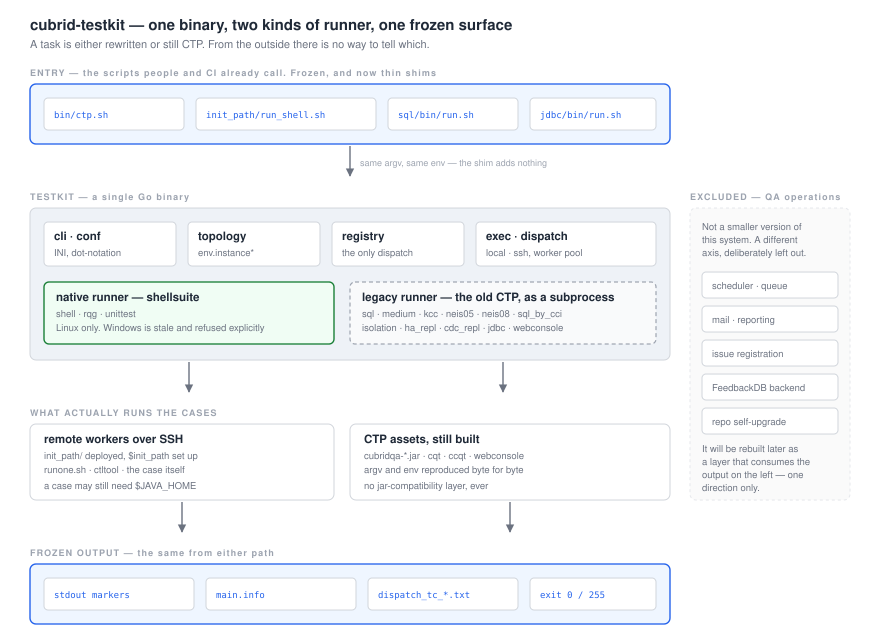

**cubrid-testkit** runs CUBRID's functional tests. Find the cases, run them against an engine,
decide whether each one passed, write down what happened — and nothing else.

It is a drop-in for CTP's `bin/ctp.sh`: the same task names, the same config keys, the same markers
on stdout, the same result files, the same exit codes. Tasks that have been rewritten in Go run
here; the rest are handed to the original CTP as a subprocess, and from outside there is no way to
tell which is which. That is what lets the old system keep running while the new one takes over one
task at a time.

Deciding *when* to run, telling people the result, and filing the issue that comes out of it are a
different job. They are out of scope, listed with reasons in
[`concept/migration-exclusions.md`](docs/concept/migration-exclusions.md), and get rebuilt later as
a layer that consumes this system's output.

For engine developers and QA. Part of
[CUBRID Systems Research](https://github.com/cubrid-systems).

> **Where it is:** Phase 3 is in progress. `unittest` runs natively, and `shell` runs end-to-end
> and agrees with CTP on four real cases — behind an opt-in gate until the full corpus clears.
> Every other task dispatches to CTP unchanged. A shell run can now use several slots on one
> machine; see [`docs/category/shell/`](docs/category/shell/README.md) and [Status](#status).

## Prerequisites

| | Why |
|---|---|
| **Go** | to build the binary. Version from `go.mod` |
| **A CTP checkout** | any task that has not been rewritten runs the original as a subprocess: `CTP_HOME`, and `JAVA_HOME` for that path |
| **A CUBRID build** | the engine under test, with its own install and `CUBRID_DATABASES` |
| **A testcases checkout** | the cases themselves, for the tasks that read a corpus |

Linux. Windows is stale and out of scope — the native runner refuses it and says so.

The shell suite has always needed a bash-compatible `/bin/sh` — CTP's own `init.sh` opens with
`function get_os(){` — and **the runner now arranges that itself**, binding bash over `/bin/sh`
inside its own mount namespace. The machine is not changed and nothing outside the run sees a
different shell; on a machine that already has it right the bind is skipped. Set
`TESTKIT_CONTAIN_SH` to override. Without it, on a distribution where `/bin/sh` is dash, every case
dies on `init.sh`'s first line — measured: seventeen cases, seventeen blank results, seventeen
`Syntax error: "(" unexpected`.

## Build

```bash
go build -o bin/testkit ./cmd/testkit
go test ./... -count=1
```

The tests under `internal/cli` are the frozen command line written down, so a failure there is a
contract change rather than a broken refactor. CI runs gofmt, `go vet`, the tests and the build.

## From `ctp.sh` to `testkit`

The compatibility is not a promise made in prose; it is where the binary sits. The endpoint is that
a QA machine keeps calling `bin/ctp.sh` and gets this runner, and nothing that reads the output can
tell.

**The shim is not in place yet.** `bin/ctp.sh` in `cubrid-testtools` is still the original, and it
should stay that way until the corpus comparison clears — the gate is what earns the swap. Today you
reach this runner by invoking it directly, which is what the comparison harness does when it runs
both sides on the same shard. Everything below the shim is built and running; the diagram is the
design ([`design/architecture.md`](docs/design/architecture.md)) with the top line marked as the
part that is still ahead.

```
        what a QA machine runs                what actually happens
                                              (── shim: not yet ──)
        ──────────────────────                ─────────────────────
        $ ctp.sh shell -c shell.conf   ──┐
        $ ctp.sh unittest -c u.conf    ──┤    a shim: exec testkit "$@"
        $ ctp.sh sql medium -c s.conf  ──┘              │
                                                        ▼
                                              ┌───────────────────┐
                                              │  one registry     │   task name → runner
                                              └─────────┬─────────┘
                                        rewritten ──────┴────── not yet
                                            │                     │
                                    ┌───────▼──────┐      ┌───────▼────────┐
                                    │ native (Go)  │      │ CTP, as a      │
                                    │ shell·unittest│      │ subprocess     │
                                    └───────┬──────┘      └───────┬────────┘
                                            └──────────┬──────────┘
                                                       ▼
                                        the same files, the same stdout markers,
                                        the same exit codes — the frozen surface
```

Three things follow, and they are the whole design.

**The entry scripts stay.** `bin/ctp.sh` becomes a shim that hands its arguments over unchanged, so
every Jenkins job, every `docker-entrypoint.sh`, every habit keeps working — no caller is edited and
nothing has to be migrated on a schedule. The command line is already frozen and tested as such:
`internal/cli` is that contract written down, which is what makes the eventual swap a one-line
change rather than a negotiation.

**A task is routed, not converted.** One registry turns a name into either a native runner or the
legacy one, and the legacy path reproduces CTP's argv and environment byte for byte. `shell` and
`unittest` run natively; the other twelve are handed to the original CTP.

**The output belongs to neither.** Both paths write through the same result layer, because the
surface is a property of the output rather than of whichever implementation ran
([ADR-003](docs/adr/ADR-003-external-surface-freeze.md)). That is what lets a task move from one
side to the other without anything downstream noticing — and what makes the equivalence gate
meaningful, since it compares two runners' files rather than two runners' intentions.

So the usage below is the usage `ctp.sh` has always had: same task names, same `-c`, same exit
codes. `testkit` is what you type today; `ctp.sh` is what a machine will type, and the point of
freezing the command line first is that the two are the same words.

## Using it

```
testkit <task>... [-c <conf>] [--interactive] [-h] [-v]
```

```bash
testkit shell -c shell.conf
testkit sql medium -c ~/CTP/conf/sql.conf     # several tasks, in the order given
TESTKIT_NATIVE_SHELL=1 testkit shell -c shell.conf
```

Task names are matched case-insensitively. A name that is not a task prints help and skips that
task only — the tasks after it still run. `CTP_HOME` comes from the environment if it is set,
otherwise from the parent of the binary.

**`run-shell` is the other CLI tree** — one case, looped until it fails, which is what you reach for
after the suite has told you a case is unreliable:

```bash
testkit run-shell --loop --maxloop 200 _01_utility/_38_csql/csql1
testkit run-shell -h
```

`--loop`, `--maxloop`, `--maxtime`, `--extend-script` and `--prompt-continue` are the axis-T options
of CTP's `run_shell.sh`; the testcase argument may name the case directory, its `cases/`
subdirectory, or a file in either, and defaults to the working directory. Touching a file named
`STOP` in the case directory ends the loop after the attempt in flight. The seven QA-operations
options — `--update-build`, `--enable-report`, `--mailto` and the rest — say so by name instead of
being ignored.

**Fourteen tasks**, the set CTP accepts:

| | |
|---|---|
| runs natively | `unittest` · `shell` behind `TESTKIT_NATIVE_SHELL=1` |
| dispatched to CTP | `sql` `medium` `kcc` `neis05` `neis08` `sql_by_cci` `rqg` `isolation` `ha_repl` `cdc_repl` `jdbc` `webconsole` |

Seven more names — `cci` `dots` `nbd` `sysbench` `tpcc` `tpcw` `ycsb` — are ones CTP accepted and
silently did nothing about. They now say they are retired and move on to the next task: the same
outcome, without the silence.

The runner runs on **one machine** ([ADR-014](docs/adr/ADR-014-one-machine.md)): local by default,
and a remote machine over SSH is still one machine. RMI worker mode is retired and asking for it
fails loudly rather than falling back.

### What a run leaves behind

The result files are part of the frozen surface, so they are the same whichever runner produced
them: `dispatch_tc_ALL.txt` and `dispatch_tc_FIN_local.txt` (the cases found and finished),
`test_status.data` and `check_local.log` (the verdicts), `current_task_id`, `monitor_local.log`,
`main_snapshot.properties`, `feedback.log`, `test-shell.xml`, `test_local.log`, plus `main.info`
and `summary_info`.

One file is this runner's own, and it is absent unless it has something to say: `patched.txt`, the
cases that did not run as the corpus has them. See [`patches/README.md`](patches/README.md).



## The shell task in detail

`shell` is the task this project has rewritten, and it is the one with options: parallel slots on
one machine, a corpus that cleans itself up, per-case patches, and a progress page.

**[`docs/category/shell/`](docs/category/shell/README.md) is the guide** — the module structure,
every configuration key with what it costs, how the memory ceiling fails a run when it is sized
wrong, how to run it on a host and in Docker, and what to set.

The short version:

```bash
CUBRID=/path/to/install tools/sizing.sh          # once, to size the run

TESTKIT_CONTAIN=1 TESTKIT_NATIVE_SHELL=1 testkit shell -c shell.conf
```

No root and no container runtime: the namespaces and the overlay are both unprivileged. It also
runs inside Docker, which needs `--security-opt seccomp=unconfined` and
`--security-opt systempaths=unconfined` but not `--privileged`.

Parallelism is off by default, and a slotted run writes the files a serial run writes — slots share
an environment id on purpose, so the output does not say how many there were.


## What it does




One binary. Every entry script becomes a shim that hands its arguments over unchanged, and a single
registry turns a task name into either a native runner or the legacy runner, which reproduces CTP's
argv and environment byte for byte. Both paths write the same output, because the surface belongs to
the output layer rather than to whichever implementation ran.

There is no jar-compatibility layer: old modules keep their own jars, which keep being built, until
their turn comes. [`design/architecture.md`](docs/design/architecture.md) and
[`design/contracts.md`](docs/design/contracts.md) are the specifications.

## The frozen surface

[`concept/external-surface-freeze.md`](docs/concept/external-surface-freeze.md) is normative, and
everything in it carries a grade you can rely on:

| | |
|---|---|
| **F1** | byte-identical. Something out there greps this |
| **F2** | same meaning; order, spacing and extra detail may differ |
| **F3** | must be accepted as input; the internal representation is free |
| **NF** | not frozen |
| **unsettled** | no grade yet, with the date that gets resolved |

Some of it is deliberately ugly and stays that way. `main.info` separates with `:` and
`summary_info` with `=`; both are F1 and will not be harmonised. `-1` is returned as an exit code
and reaches the shell as 255; it will not be tidied into `1`.

**The freeze preserves what CTP did, not what CTP got wrong.** Where a behaviour is plainly
unintended and reproducing it would make someone trust something false, it is fixed and the decision
recorded. Three so far: the requirements check now actually fails on a missing command — it used to
match csh's wording and so reported `PASS` for everything absent; `dos2unix` is off the required
list, because nothing in the corpus needs it; and a build with no commit suffix is now just its
version instead of `11.2.0.0000) (64bit release build for linux_gnu`.

## Status

| Phase | | |
|---|---|---|
| 0 — analysis | **done** | 39 documents on what CTP actually does |
| 1 — concept and freeze | **done** | north star, the freeze spec with a 24-row old↔new mapping, non-goals NG1–NG11, migration exclusions |
| 2 — architecture | **done** | architecture, five contracts, four module documents |
| **3 — rewrite `shell`** | **in progress** | `unittest` native; `shell` end-to-end and matching CTP's verdicts on four real cases; `run-shell` complete, with six axis-T options. The harness that compares a corpus is built; the gate is running it. Parallel slots, a corpus that cleans itself, per-case durations and a progress page are in and measured |
| 4 — the rest | — | `sql` family, `isolation`, `ha_repl`, `cdc_repl`, `jdbc` |
| 5 — retire | — | isolate what is no longer called; decide what to keep |

![Animated: CTP and testkit run on the same four cases on the same machine in the same minute. Both report three passed and one failed, the same case failing on both, and exit 0. Of the ten files a run leaves behind, six are byte-identical after normalisation, one is identical once the JVM's own properties are removed, and three differ by a named number of lines. Ten of those lines are still unexplained, and the largest difference turned out to be a defect in the new runner rather than a difference between the two.](docs/assets/anim-equivalence.svg)

**What is proven.** CTP and testkit, run on the same four cases on the same machine in the same
minute: both **3 passed, 1 failed**, the same case failing on both, the same summary counters, exit
code 0. Of the ten files a run leaves behind, **six are byte-identical** after normalisation —
including the two that carry the verdicts — one more is identical once the JVM's own system
properties are removed, and the remaining three differ by a named number of lines
([`evidence/regression-shell.md`](docs/evidence/regression-shell.md)).

Those counts were taken again on 2026-09-07 and most of them moved, because the largest difference
turned out to be **this runner's own defect** — a failing case wrote its console output to the
worker log twice — and `test_local.log` fell from 650 lines to 154 when it was fixed. Ten lines are
still unexplained, and saying so is the point: the page previously had one unexplained difference
and it was the wrong one.

**The gate.** Equivalence is proven by comparing normalised output over the whole shell corpus —
3,475 cases, with the 195 in `_25_unstable` counted separately because their own readme says they
depend on machine load and elapsed time ([ADR-013](docs/adr/ADR-013-regression-equivalence.md)).
`TESTKIT_NATIVE_SHELL` comes off when that clears. That is 64 shards and tens of hours on each
runner, so it is run by [`evidence/compare/`](docs/evidence/compare/README.md) rather than by hand:
a shard is the unit of resume, the six files that carry verdicts are held to zero differences with
no baseline allowed, and everything else is classified — so that a difference nobody has seen
before is the only thing on the page.

![Animated: how the whole shell corpus is compared. 3,452 cases are cut into 64 shards, with _06_issues holding half of everything and split into sub-shards; every case lands in exactly one shard. One shard runs on CTP and on testkit, both result trees are kept, and a shard whose report already ends in COMPLETE is skipped, so the loop survives being killed. In the report the six files that carry verdicts must be identical with no baseline allowed, and the other four are classified: on the four-case calibration 154 differences became 143 known and 11 new, and ten of the eleven are one finding.](docs/assets/anim-compare.svg)

**Corrections are recorded where the mistake was made.** The CLI survey that justified the project
covered one entry point out of fifteen; the freeze specification was wrong in eight further places;
the corpus counts were 3,722 and 204 until the discovery rule was fixed; and the one difference the
first comparison could not explain was blamed on the environment when it belonged to this runner
([`evidence/spec-corrections.md`](docs/evidence/spec-corrections.md)).

## Layout

```
CONTEXT.md               the glossary — task ≠ suite ≠ module ≠ runner
cmd/testkit/             the entry point
internal/                cli · conf · registry · dispatch · runner (legacy, shellsuite) ·
                         runshell · exec · result · feedback · topology ·
                         contain (namespaces per slot) · plan (case durations) ·
                         status (the progress page)
tools/sizing.sh          how many slots and how big a ceiling, for this machine
ext/cubrid-sqlancer/     submodule — a SQLancer provider for CUBRID
docs/
  ROADMAP.md             phases, exit conditions, risks, the re-evaluation gate
  adr/                   decisions, numbered; README.md is the numbering authority
  category/              one folder per test category: how to run it, and what to set
  concept/               north star, the freeze, non-goals, exclusions
  design/                architecture, contracts, one doc per module
  analysis/              what CTP actually does, measured
  evidence/              regression evidence, the normaliser, and the corrections
    compare/             the harness that runs the corpus and classifies what differs
  extensions/            testing axes CTP never had
  survey/                the DBMS testing ecosystem, classified into eight axes
```

## Where to start reading

| If you want | Read |
|---|---|
| the vocabulary | [`CONTEXT.md`](CONTEXT.md) |
| what this system is for | [`concept/north-star.md`](docs/concept/north-star.md) |
| what may never change | [`concept/external-surface-freeze.md`](docs/concept/external-surface-freeze.md) |
| what was left out, and why | [`concept/migration-exclusions.md`](docs/concept/migration-exclusions.md) |
| how it is built | [`design/architecture.md`](docs/design/architecture.md) · [`design/contracts.md`](docs/design/contracts.md) |
| how equivalence is decided, and run | [`adr/ADR-013`](docs/adr/ADR-013-regression-equivalence.md) · [`evidence/compare/`](docs/evidence/compare/README.md) |
| how to run the shell suite | [`category/shell/`](docs/category/shell/README.md) |
| how a run is made parallel | [`concept/beyond-axis.md`](docs/concept/beyond-axis.md) B-T3, B-T12, B-T13 |
| where the run's hours go, and what to do next | [`concept/beyond-axis.md`](docs/concept/beyond-axis.md) B-T14 |
| what the old system could fix cheaply | [`evidence/ctp-improvements.md`](docs/evidence/ctp-improvements.md) |
| what happens next | [`ROADMAP.md`](docs/ROADMAP.md) · [`design/module-shell.md`](docs/design/module-shell.md) |
| every decision so far | [`adr/README.md`](docs/adr/README.md) |

New documents are in English. The Phase 0–2 documents under `docs/` are in Korean and stay that
way — a freeze specification is worth exactly what its sentences are worth, and re-writing six
thousand lines of analysis buys nothing but a chance to introduce errors.
