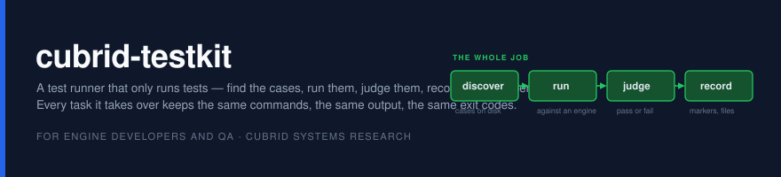
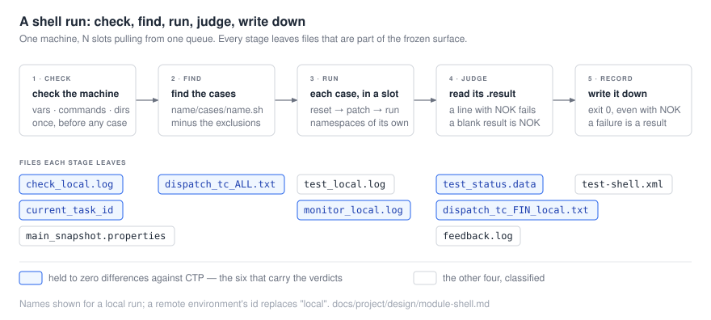

**cubrid-testkit** runs CUBRID's functional tests. Find the cases, run them against an engine,
decide whether each one passed, write down what happened — and nothing else.

It is a drop-in for CTP's `bin/ctp.sh`: the same task names, the same config keys, the same markers
on stdout, the same result files, the same exit codes. Tasks that have been rewritten in Go run
here; the rest are handed to the original CTP as a subprocess, and from outside there is no way to
tell which is which. That is what lets the old system keep running while the new one takes over one
task at a time.

Deciding *when* to run, telling people the result, and filing the issue that comes out of it are a
different job. They are out of scope, listed with reasons in
[`project/concept/migration-exclusions.md`](docs/project/concept/migration-exclusions.md), and get
rebuilt later as a layer that consumes this system's output.

For engine developers and QA. Part of
[CUBRID Systems Research](https://github.com/cubrid-systems).

> **Where it is:** `unittest` runs natively. `sql` and `medium` run natively behind
> `TESTKIT_NATIVE=sql` and passed [ADR-017](docs/project/evidence/regression-sql.md)'s gate at
> upstream develop's head. `shell` and `rqg` run natively behind `TESTKIT_NATIVE=shell`, over the
> whole corpus; the full-corpus comparison against CTP has not cleared yet. `isolation` runs natively
> behind `TESTKIT_NATIVE=isolation`, with CTP's own `runone.sh` still executing every case, four
> slots at once by default; its gate, [ADR-018](docs/project/adr/ADR-018-isolation-equivalence.md),
> found no runner difference with one slot or with four. Every other task
> dispatches to CTP unchanged. See [Status](#status).

## Prerequisites

| | Why |
|---|---|
| **Go 1.25+** | to build the binary (`go.mod`) |
| **A CTP checkout** | any task that has not been rewritten runs the original as a subprocess: `CTP_HOME`, and `JAVA_HOME` for that path |
| **A CUBRID build** | the engine under test, with its own install and `CUBRID_DATABASES` |
| **A testcases checkout** | the cases themselves, for the tasks that read a corpus |

Linux. Windows is stale and out of scope — the native runner refuses it and says so.

The shell suite has always needed a bash-compatible `/bin/sh` — CTP's own `init.sh` opens with
`function get_os(){` — and **the runner now arranges that itself**, binding bash over `/bin/sh`
inside its own mount namespace. The machine is not changed and nothing outside the run sees a
different shell; on a machine that already has it right the bind is skipped. Set
`TESTKIT_CONTAIN_SH` to override. Without it, on a distribution where `/bin/sh` is dash, every case
dies on `init.sh`'s first line — measured: seventeen cases, seventeen blank results, seventeen
`Syntax error: "(" unexpected`.

## Build

```bash
go build -o bin/testkit ./cmd/testkit
go test ./... -count=1
```

The tests under `internal/cli` are the frozen command line written down, so a failure there is a
contract change rather than a broken refactor. CI runs gofmt, `go vet`, the tests and the build.

## From `ctp.sh` to `testkit`

The compatibility is not a promise made in prose; it is where the binary sits. The endpoint is that
a QA machine keeps calling `bin/ctp.sh` and gets this runner, and nothing that reads the output can
tell.


**The shim is not in place yet** — the dashed box. `bin/ctp.sh` in `cubrid-testtools` is still the
original, and it should stay that way until the corpus comparison clears — the gate is what earns
the swap. Today you reach this runner by invoking it directly, which is what the comparison harness
does when it runs both sides on the same shard. Everything below the shim is built and running.

Three things follow, and they are the whole design.

**The entry scripts stay.** `bin/ctp.sh` becomes a shim that hands its arguments over unchanged, so
every Jenkins job, every `docker-entrypoint.sh`, every habit keeps working — no caller is edited and
nothing has to be migrated on a schedule. The command line is already frozen and tested as such:
`internal/cli` is that contract written down, which is what makes the eventual swap a one-line
change rather than a negotiation.

**A task is routed, not converted.** Legacy registers first and claims all fourteen tasks; a native
runner registered after it takes over the ones it names. `unittest` always runs natively, `shell`
and `rqg` when `TESTKIT_NATIVE` names `shell`, `sql` and `medium` when it names `sql`, `isolation`
when it names `isolation`; the legacy
path reproduces CTP's argv and environment byte for byte for everything else. There is no
jar-compatibility layer: old modules keep their own jars, which keep being built, until their turn
comes.

**The output belongs to neither.** Every path writes through the same result layer, because the
surface is a property of the output rather than of whichever implementation ran
([ADR-003](docs/project/adr/ADR-003-external-surface-freeze.md)). That is what lets a task move from
one side to the other without anything downstream noticing — and what makes the equivalence gate
meaningful, since it compares two runners' files rather than two runners' intentions.

[`project/design/architecture.md`](docs/project/design/architecture.md) and
[`project/design/contracts.md`](docs/project/design/contracts.md) are the specifications.

## Using it

```
testkit <task>... [-c <conf>] [--interactive] [-h] [-v]
```

```bash
testkit shell -c shell.conf
testkit sql medium -c ~/CTP/conf/sql.conf     # several tasks, in the order given
TESTKIT_NATIVE=shell testkit shell -c shell.conf
```

Task names are matched case-insensitively. A name that is not a task prints help and skips that
task only — the tasks after it still run. `CTP_HOME` comes from the environment if it is set,
otherwise from the parent of the binary.

**`run-shell` is the other CLI tree** — one case, looped until it fails, which is what you reach for
after the suite has told you a case is unreliable:

```bash
testkit run-shell --loop --maxloop 200 _01_utility/_38_csql/csql1
testkit run-shell -h
```

`--loop`, `--maxloop`, `--maxtime`, `--extend-script` and `--prompt-continue` are the axis-T options
of CTP's `run_shell.sh`; the testcase argument may name the case directory, its `cases/`
subdirectory, or a file in either, and defaults to the working directory. Touching a file named
`STOP` in the case directory ends the loop after the attempt in flight. The seven QA-operations
options — `--update-build`, `--enable-report`, `--mailto` and the rest — say so by name instead of
being ignored.

**Fourteen tasks**, the set CTP accepts:

| | |
|---|---|
| runs natively | `unittest` · `shell` and `rqg` behind `TESTKIT_NATIVE=shell` · `sql` and `medium` behind `TESTKIT_NATIVE=sql` · `isolation` behind `TESTKIT_NATIVE=isolation` |
| dispatched to CTP | `kcc` `neis05` `neis08` `sql_by_cci` `ha_repl` `cdc_repl` `jdbc` `webconsole`, and any family whose gate is off |

`TESTKIT_NATIVE` names the families, comma-separated, and `all` is every one of
them. The older `TESTKIT_NATIVE_SHELL=1` and `TESTKIT_NATIVE_SQL=1` still work.

Seven more names — `cci` `dots` `nbd` `sysbench` `tpcc` `tpcw` `ycsb` — are ones CTP accepted and
silently did nothing about. They now say they are retired and move on to the next task: the same
outcome, without the silence.

The runner runs on **one machine** ([ADR-014](docs/project/adr/ADR-014-one-machine.md)): local by
default, and a remote machine over SSH is still one machine. RMI worker mode is retired and asking
for it fails loudly rather than falling back.

### What a run leaves behind

The result files are part of the frozen surface, so they are the same whichever runner produced
them. A shell run leaves ten:



The sql family writes CQT's own records instead — `main.info`, `summary_info`, `summary.xml`, the
JUnit report and a `.result` beside every case; [`category/sql/`](docs/category/sql/README.md) lists
them.

One file is this runner's own, and it is absent unless it has something to say: `patched.txt`, the
cases that did not run as the corpus has them. See [`patches/README.md`](patches/README.md).

## The shell task in detail

`shell` is the task this project rewrote first, and it is the one with options: parallel slots on
one machine, a corpus that cleans itself up, per-case patches, and a progress page.

**[`docs/category/shell/`](docs/category/shell/README.md) is the guide** — the module structure,
every configuration key with what it costs, how the memory ceiling fails a run when it is sized
wrong, how to run it on a host and in Docker, and what to set.

**[`docs/category/sql/`](docs/category/sql/README.md) is the same guide for `sql` and `medium`** —
the stages and the executor, every key and switch, what parallel buys and what it costs on the
machine you have, and how to read a failure that is the corpus's order rather than the engine's.

**[`docs/category/isolation/`](docs/category/isolation/README.md) is the guide for `isolation`** — the
stages and what `runone.sh` does with a case, the `.ctl` language as `qactl` reads it, every key, and
the cases CTP cannot reproduce either.

The short version:

```bash
CUBRID=/path/to/install tools/sizing.sh          # once, to size the run

TESTKIT_CONTAIN=1 TESTKIT_NATIVE=shell testkit shell -c shell.conf
```

No root and no container runtime: the namespaces and the overlay are both unprivileged. It also
runs inside Docker, which needs `--security-opt seccomp=unconfined` and
`--security-opt systempaths=unconfined` but not `--privileged`.

Parallelism is off by default, and a slotted run writes the files a serial run writes — slots share
an environment id on purpose, so the output does not say how many there were.

## The frozen surface

[`project/concept/external-surface-freeze.md`](docs/project/concept/external-surface-freeze.md) is
normative, and everything in it carries a grade you can rely on:

| | |
|---|---|
| **F1** | byte-identical. Something out there greps this |
| **F2** | same meaning; order, spacing and extra detail may differ |
| **F3** | must be accepted as input; the internal representation is free |
| **NF** | not frozen |
| **unsettled** | no grade yet, with the date that gets resolved |

Some of it is deliberately ugly and stays that way. `main.info` separates with `:` and
`summary_info` with `=`; both are F1 and will not be harmonised. `-1` is returned as an exit code
and reaches the shell as 255; it will not be tidied into `1`.

**The freeze preserves what CTP did, not what CTP got wrong.** Where a behaviour is plainly
unintended and reproducing it would make someone trust something false, it is fixed and the decision
recorded. Three so far: the requirements check now actually fails on a missing command — it used to
match csh's wording and so reported `PASS` for everything absent; `dos2unix` is off the checked
list, because no answer file in the corpus has a CRLF — though CTP's `init.sh` still calls it, so a
machine without it gets a stand-in (`internal/contain/dos2unix.go`); and a build with no commit
suffix is now just its version instead of `11.2.0.0000) (64bit release build for linux_gnu`.

## Status

| Phase | | |
|---|---|---|
| 0 — analysis | **done** | 39 documents on what CTP actually does |
| 1 — concept and freeze | **done** | north star, the freeze spec with a 24-row old↔new mapping, non-goals NG1–NG11, migration exclusions |
| 2 — architecture | **done** | architecture, five contracts, four module documents |
| **3 — rewrite `shell`** | **in progress** | `unittest` native; `shell` over the whole corpus at develop head, every failure attributed; `run-shell` complete, with six axis-T options; slots, a corpus that cleans itself, per-case patches and a progress page are in and measured. The full-corpus comparison against CTP has not cleared |
| **4 — the rest** | **in progress** | `sql` and `medium` native, ADR-017's gate passed; `isolation` native over the whole corpus, ADR-018's gate met, four slots by default; `ha_repl`, `cdc_repl` and `jdbc` still CTP's |
| 5 — retire | — | isolate what is no longer called; decide what to keep |

**What is proven, for sql and medium.** CTP and testkit over the whole of both corpora, serial, with
the engine, the cases and CTP all at upstream develop's head: medium identical in every file, and a
clean sql run byte-identical to a clean CTP run — 17,459 `.result` files and 2,762 record files
([`project/evidence/regression-sql.md`](docs/project/evidence/regression-sql.md)).

**What is measured, for isolation.** CTP does not reproduce its own verdicts on this corpus: two
whole CTP runs in the same order disagree on seven of 6,772. Against them, the native runner writes
the same machine check, dispatch sets and snapshot, and every verdict it disagrees on belongs to a
case that flips under CTP too — rerun alone, three times under each runner, none of the ten
separates the two. On a 60-case sample every result file is byte-identical. Four slots take the
corpus from 12,301 s to 2,978 s, by the same rules with no runner difference
([`project/evidence/isolation-baseline.md`](docs/project/evidence/isolation-baseline.md)).

**What is proven, for shell.** Equivalence here is not byte-identity, because some of what a run
writes cannot match between two runs — paths, times, dates. So both sides are normalised, and then
held to different standards:


The first comparison was four cases on 2026-09-02: both sides 3 passed and 1 failed, the same case
failing on both, and the six verdict files byte-identical
([`project/evidence/regression-shell.md`](docs/project/evidence/regression-shell.md)). On
2026-09-14 the whole corpus ran at develop head — 3,216 cases judged, 3,184 passed, every one of the
32 failures attributed — and one shard was compared on both `main` and the branch that brought the
sql family: the two binaries were indistinguishable
([`project/evidence/parallel-shell.md`](docs/project/evidence/parallel-shell.md) §6–7).

**The gate.** `TESTKIT_NATIVE=shell` stops being opt-in when the comparison clears over the whole
corpus ([ADR-013](docs/project/adr/ADR-013-regression-equivalence.md)). At `2a22a74c` that is 3,477
cases in 64 shards, with the 201 in `_25_unstable` counted separately because their own readme says
they depend on machine load and elapsed time — too many hours to run by hand, so
[`project/evidence/compare/`](docs/project/evidence/compare/README.md) runs it:


A shard is the unit of resume. Run in place, a case that leaves a database behind hands it to
whichever runner goes second — and that one is always testkit — so where a shard's cases create
databases, `shard-clean.sh` puts the tree back between the two runs.

**Corrections are recorded where the mistake was made.** The CLI survey that justified the project
covered one entry point out of fifteen; the freeze specification was wrong in eight further places;
the corpus counts were 3,722 and 204 until the discovery rule was fixed; the one difference the
first comparison could not explain was blamed on the environment when it belonged to this runner;
and a shard comparison once blamed the runner for what the runner before it had left
([`project/evidence/spec-corrections.md`](docs/project/evidence/spec-corrections.md)).

## Layout

```
CONTEXT.md               the glossary — task ≠ suite ≠ module ≠ runner
cmd/testkit/             the entry point
internal/                cli · conf · registry · dispatch · runshell · exec · result · feedback ·
                         topology · runner (legacy, shellsuite, sqlsuite, isolationsuite) ·
                         contain (namespaces per slot) · plan (case durations) ·
                         patch (per-case patches) · coredump (a crashed case's stack) ·
                         status (the progress page)
patches/                 fixes carried for the corpus until upstream takes them
exclusions/              cases this machine cannot run, each with the reason and what ends it
tools/sizing.sh          how many slots, which disk, and how big a ceiling, for this machine
                         (`tools/sizing.sh sql <conf>` for the sql family)
ext/cubrid-sqlancer/     submodule — a SQLancer provider for CUBRID
docs/
  assets/                the diagrams these pages use
  category/              how to run each test category, and what to set
    shell/  sql/         the as-built guides
    isolation/           the same, for isolation
    extensions/          testing axes CTP never had
  project/               why the rewrite exists and how it is built
    ROADMAP.md           phases, exit conditions, risks, the re-evaluation gate
    adr/                 decisions, numbered; README.md is the numbering authority
    concept/             north star, the freeze, non-goals, exclusions
    design/              architecture, contracts, one doc per module
    analysis/            what CTP actually does, measured
    evidence/            regression evidence, the normaliser, and the corrections
      compare/           the harness that runs the corpus and classifies what differs
    survey/              the DBMS testing ecosystem, classified into eight axes
```

## Where to start reading

| If you want | Read |
|---|---|
| the vocabulary | [`CONTEXT.md`](CONTEXT.md) |
| how to run the shell suite | [`category/shell/`](docs/category/shell/README.md) |
| how to run sql and medium | [`category/sql/`](docs/category/sql/README.md) |
| how to run isolation | [`category/isolation/`](docs/category/isolation/README.md) |
| what this system is for | [`project/concept/north-star.md`](docs/project/concept/north-star.md) |
| what may never change | [`project/concept/external-surface-freeze.md`](docs/project/concept/external-surface-freeze.md) |
| what was left out, and why | [`project/concept/migration-exclusions.md`](docs/project/concept/migration-exclusions.md) |
| how it is built | [`project/design/architecture.md`](docs/project/design/architecture.md) · [`project/design/contracts.md`](docs/project/design/contracts.md) |
| how equivalence is decided, and run | [`project/adr/ADR-013`](docs/project/adr/ADR-013-regression-equivalence.md) · [`project/evidence/compare/`](docs/project/evidence/compare/README.md) |
| how a run is made parallel | [`project/concept/beyond-axis.md`](docs/project/concept/beyond-axis.md) B-T3, B-T12, B-T13 |
| where the run's hours go, and what to do next | [`project/concept/beyond-axis.md`](docs/project/concept/beyond-axis.md) B-T14 |
| what the old system could fix cheaply | [`project/evidence/ctp-improvements.md`](docs/project/evidence/ctp-improvements.md) |
| what happens next | [`project/ROADMAP.md`](docs/project/ROADMAP.md) · [`project/design/module-shell.md`](docs/project/design/module-shell.md) |
| every decision so far | [`project/adr/README.md`](docs/project/adr/README.md) |

New documents are in English. The Phase 0–2 documents under `docs/project/` are in Korean and stay
that way — a freeze specification is worth exactly what its sentences are worth, and re-writing six
thousand lines of analysis buys nothing but a chance to introduce errors.
