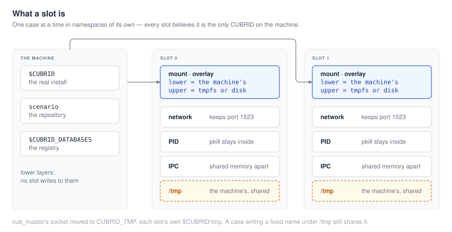

# 1. 런은 어떻게 도는가

*[English](01-how-a-run-works.md) · 한국어*

[← shell 카테고리로](README.ko.md)

- [단계들](#단계들)
- [슬롯이란 무엇인가](#슬롯이란-무엇인가)
- [빈 슬롯은 어느 케이스를 가져가는가](#빈-슬롯은-어느-케이스를-가져가는가)
- [모듈 구조](#모듈-구조)

## 단계들

```
  머신을 점검한다        한 번만. 케이스를 돌릴 수 없는 머신이 3,444 번이 아니라
        |                여기서 한 번 그렇게 말하도록
        v
  코퍼스를 준비한다      읽기 전용 하위 층. 모든 쓰기는 오버레이로 간다
        v
  케이스를 찾는다        <scenario>/**/<name>/cases/<name>.sh, 그 다음 제외 목록.
        v                읽을 수 없는 디렉터리는 [WARN] 이지 중단이 아니다
  순서를 정한다          긴 것부터. 이전 런이 case_plan 을 남겼다면 거기서
        v
  배포한다               CTP 케이스들이 source 하는 헬퍼들, 그리고 모든 케이스가
        v                되돌려지는 스냅샷
  돌린다                 N 개 슬롯이 하나의 큐에서 당겨간다 — 케이스마다:
        |                  리셋 → 패치가 있으면 적용 → 실행 → 새 오류 확인 →
        v                  .result 읽기 → 판정 기록
  재시도                 시작할 것이 더 이상 없을 때만
        v
  전부 적는다            동결 파일들, 그리고 이 런이 측정한 소요시간과 발자국을
                         다음 런을 위해
```

## 슬롯이란 무엇인가

슬롯은 **자기만의 네임스페이스 안에서 한 번에 케이스 하나**다. 그래서 슬롯을 여럿 두는 데 설정
비용이 들지 않는다: 모든 슬롯이 자기가 이 머신의 유일한 CUBRID 라고 믿는다.



슬롯마다 네임스페이스 넷:

| 네임스페이스 | 무엇을 사주는가 |
|---|---|
| **network** | 모든 슬롯이 출하된 포트 1523 을 그대로 쓴다. 어떤 conf 도 다시 쓰이지 않고 포트도 할당되지 않는다 |
| **PID** | 케이스 안의 `pkill cub` 이 그 슬롯의 서버만 죽이고 다른 것은 건드리지 않는다 |
| **IPC** | 브로커 공유 메모리가 슬롯 사이에서 충돌하지 않는다 |
| **mount** | 오버레이, 그리고 머신의 것 위에 bind 된 bash 호환 `/bin/sh` |

**`/tmp` 는 분리되지 않는다.** 슬롯들이 실제로 거기서 충돌했다 — `cub_master` 의 소켓
`/tmp/CUBRID1523` 에서 마스터 넷이 소켓 하나를 두고 다투었고, 아무도 올라오지 못했다. 그 소켓은
이제 `CUBRID_TMP` 로 가고, 각 슬롯이 그것을 자기 디렉터리로 설정한다: 슬롯 오버레이 뒤의
`$CUBRID/tmp`. **`/tmp` 아래에 고정된 이름으로 쓰는 케이스는 여전히 다른 모든 슬롯 및 머신과
그것을 공유한다.**

오버레이가 코퍼스를 깨끗하게 유지하는 장치다: **디스크의 시나리오에는 절대 쓰지 않는다.**
케이스의 쓰기 — 데이터베이스, 로그, `.result` — 는 상위 층에 떨어지고, 한 디렉터리의 마지막
케이스가 끝나면 버려진다.

네임스페이스에는 `TESTKIT_CONTAIN=1` 이 필요하다. 없으면 네임스페이스도 없고, 슬롯은 조용히
충돌하는 대신 **시작을 거부한다.**

## 빈 슬롯은 어느 케이스를 가져가는가

큐는 케이스를 긴 것부터 정렬하는데, 이는 makespan 에 대해서는 옳고 나머지 전부에 대해서는
틀리다: 24 슬롯이면 가장 무거운 케이스 24 개를 한꺼번에 시작한다. 그래서 **순서가 제안하고
정책이 처분한다.**

```
   큐 (긴 것부터)                정책                      슬롯
   ────────────────              ────                      ────
   케이스 A  (523 s, 9 GB)  ──►  HeavyCap: 무거운 것이      A 시작
   케이스 B  (490 s, 8 GB)  ──►    이미 n 개 떠 있나?  ──►  B 대기
   케이스 C  (17 s, 40 MB)  ──►  Headroom: tmpfs 가         C 시작
   …                               high_water 위인가?
```

| 정책 | 무엇을 거부하는가 |
|---|---|
| `HeavyCap` | 가장 무거운 케이스를 `heavy_in_flight_max` 개보다 많이 동시에. 이것은 **시작** 에 관한 것이고, 그 지점에서는 피드백 규칙이 도울 수 없다 — 아직 쓰인 것이 없기 때문이다 |
| `Headroom` | tmpfs 가 `scenario_ram_high_water` 퍼센트 위인 동안 새로운 것 전부. 이것은 그 이후 전부에 관한 것이고, 그 지점에서 믿을 수 있는 유일한 수는 머신이 보고하는 수다 |

어느 쪽도 **유일한** 케이스를 거부하도록 요청받는 일은 없다: 아무것도 돌고 있지 않으면 큐는
무조건 하나를 내준다. **전부를 거부할 수 있는 정책은 런을 멈출 수 있는 정책이기 때문이다.**

## 모듈 구조

패키지 넷. `shellsuite` 만 shell 전용이고 나머지 셋은 범용이며 이후 카테고리들이 쓴다.

### `internal/runner/shellsuite` — 카테고리

| 파일 | 무엇을 소유하는가 |
|---|---|
| `shell.go` | 런 자체: conf 를 읽고, 아래 전부를 연결하고, 위의 단계 순서를 소유한다 |
| `discover.go` | 무엇이 케이스로 세어지는지, 그리고 두 가지 제외 메커니즘 |
| `corpus.go` | 런이 보는 시나리오 트리, 그리고 디렉터리마다 최대 발자국을 재는 감시자 |
| `deploy.go` | 첫 케이스 전에 참이어야 하는 것들, 그리고 각 케이스가 되돌려지는 스냅샷 |
| `worker.go` | 슬롯 하나: 당기고, 리셋하고, 돌리고, 판정하고, 반복 |
| `case.go` | 케이스가 케이스 자신이 아닌 런에게서 필요로 하는 것 |
| `prologue.go` | 모든 케이스 스크립트에 주어지는 머리말 |
| `check.go` | 머신 점검 — 변수, 명령, 디렉터리 |
| `monitor.go` | 워커를 얼마나 자주 들여다보는지, 그리고 무엇이 멈춘 것으로 세어지는지 |
| `patch.go` | 런이 필요로 하지만 소유하지 않는 케이스별 코퍼스 변경 |
| `registry.go` | 오버레이 안에서의 `$CUBRID_DATABASES` 격리 |
| `lanes.go` | 메모리 레인과 디스크 레인의 분리 |
| `safepath.go` | 루트가 비었거나 `/` 인 삭제를 거부한다 |
| `setup.go` | 런이 무엇을 요청받았는지. 페이지가 보여줄 수 있도록 |

### `internal/contain` — 슬롯 하나의 격리

| 파일 | 무엇을 소유하는가 |
|---|---|
| `contain.go` | `Enter` 는 새 user·mount·PID·IPC 네임스페이스에서 바이너리를 재실행한다. `Init` 은 PID 1 을 **거두기만 하는** reaper 로 만든다. `Setup` 은 bash 호환 `/bin/sh` 를 bind 한다 |
| `slot.go` | `$CUBRID`·시나리오·레지스트리 위의 슬롯별 오버레이 |
| `linker.go` | 슬롯이 보는 설치본을 일관되게 유지하는 shim |

이 패키지의 두 성질이 [돌리기](03-running-it.ko.md)와 [상한](05-the-ceiling.ko.md)의 대부분을
결정한다:

- **모든 것이 네임스페이스 안에서 돈다.** `Enter` 가 `main` 이 하는 첫 번째 일이기 때문이다.
- **네임스페이스는 uid 를 정확히 하나만 매핑한다.** Docker 에서 파일 소유권이 그토록 중요한
  이유다.

### `internal/dispatch` — 큐와 정책들

`dispatch.go` 가 큐이고, `policy.go` 가 위의 `HeavyCap` 과 `Headroom` 이다.

### `internal/status` — 진행 페이지

보드와 그 JSON, 페이지, 돌고 있는 케이스의 실시간 출력, 끝난 케이스의 블록, 그리고 끝난 런의
`feedback.log` 재생.
