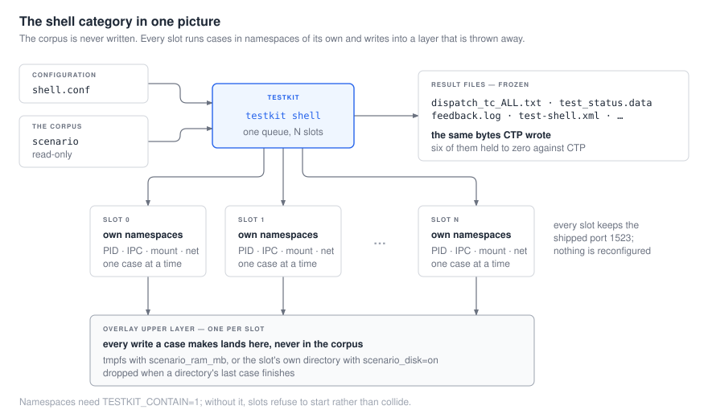

# `shell` 카테고리

*[English](README.md) · 한국어*

`shell` 은 CTP 에서 가장 큰 테스트 카테고리이고, testkit 이 처음으로 다시 쓴 것이다. 이
문서들이 그 as-built 가이드다.

| | |
|---|---|
| **[1. 런은 어떻게 도는가](01-how-a-run-works.ko.md)** | 단계들, 모듈 구조, 그리고 슬롯이 무엇인지 |
| **[2. 케이스 쓰기](02-writing-a-case.ko.md)** | 파일 배치, 헬퍼들, 그리고 복사해서 바로 돌릴 수 있는 케이스 하나 |
| **[3. 돌리기](03-running-it.ko.md)** | 호스트에서와 Docker 에서, 빈 디렉터리부터 판정까지 |
| **[4. 설정](04-configuration.ko.md)** | 모든 키, 그것이 무엇을 치르는지, 무엇을 설정할지 |
| **[5. 메모리 상한](05-the-ceiling.ko.md)** | 런을 느리게 하는 대신 실패시키는 유일한 설정 |
| **[6. 실패한 것을 남기기](06-keeping-what-failed.ko.md)** | 실패한 케이스가 무엇을 남기고, 무엇을 남겨야 하는지 |

구현 전 설계 — 옛 Java 클래스 매핑과 재작성의 근거가 된 ADR 들 — 는
[`../../project/design/module-shell.md`](../../project/design/module-shell.md) 에 있다.

## 한 장의 그림으로



**코퍼스에는 절대 쓰지 않는다.** 모든 케이스의 쓰기는 오버레이로 들어가는데, 그 하위 층은
저장소가 갖고 있는 그대로의 시나리오이고, 상위 층은 `scenario_ram_mb` 가 설정되면 메모리,
`scenario_disk=on` 이면 슬롯 자신의 디스크 디렉터리다. 한 디렉터리의 마지막 케이스가 끝나면
그 쓰기는 버려진다.

## 가장 짧은 런

```bash
mkdir -p /tmp/demo/scenario/my_first_case/cases

cat > /tmp/demo/scenario/my_first_case/cases/my_first_case.sh <<'EOF'
#!/bin/bash
. $init_path/init.sh
init test
set -x

cubrid_createdb --db-volume-size=20M --log-volume-size=20M demodb
cubrid server start demodb
csql -u dba demodb -c "CREATE TABLE t(i INT); INSERT INTO t VALUES (1),(2);"
csql -u dba demodb -c "SELECT count(*) FROM t;" > actual.log 2>&1

if grep -qE "^ +2$" actual.log; then
    write_ok
else
    write_nok "expected count(*) = 2"
fi

cubrid server stop demodb
cubrid deletedb demodb
finish
EOF

cat > /tmp/demo/shell.conf <<'EOF'
scenario=/tmp/demo/scenario
test_category=shell
feedback_type=file
testcase_retry_num=0
parallel_slots=1
EOF

TESTKIT_CONTAIN=1 TESTKIT_NATIVE=shell testkit shell -c /tmp/demo/shell.conf
```

```
Total Case:1
Total Success Case:1
Total Fail Case:0
```

[케이스 쓰기](02-writing-a-case.ko.md)가 그 스크립트의 모든 줄을 설명하고,
[돌리기](03-running-it.ko.md)가 그것이 필요로 하는 환경을 설명한다.
