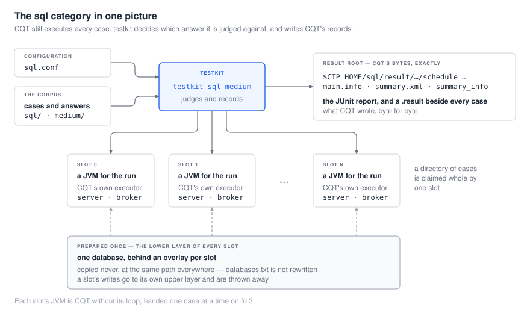

# `sql` 카테고리

*[English](README.md) · 한국어*

`sql` 과 `medium` 은 CTP 의 두 SQL 코퍼스 — 17,459 케이스와 975 케이스 — 이고, testkit 이 두
번째로 다시 쓴 계열이다. 이 문서들이 그 as-built 가이드다.

| | |
|---|---|
| **[1. 런은 어떻게 도는가](01-how-a-run-works.ko.md)** | 단계들, 실행기, 그리고 여기서 슬롯이 무엇인지 |
| **[2. 케이스 쓰기](02-writing-a-case.ko.md)** | 배치, 답이 어디서 오는지, 케이스가 따라야 할 규칙들 |
| **[3. 돌리기](03-running-it.ko.md)** | 설치본과 코퍼스에서 판정까지 |
| **[4. 설정](04-configuration.ko.md)** | 모든 키와 스위치, 무엇을 치르는지, 무엇을 설정할지 |
| **[5. 슬롯과 속도](05-slots-and-speed.ko.md)** | 병렬이 무엇을 사주고 무엇을 치르는지, 그리고 medium 이 왜 직렬인지 |
| **[6. 케이스가 실패할 때](06-when-a-case-fails.ko.md)** | 판정을 읽는 법, 그리고 엔진의 잘못이 아닌 실패들 |

구현 전 설계 — CQT 클래스 매핑, ADR 들, 그리고 그 과정에서 측정된 것 — 는
[`../../project/design/module-sql.md`](../../project/design/module-sql.md) 이고, 증거는
[`../../project/evidence/sql-native.md`](../../project/evidence/sql-native.md) 와
[`../../project/evidence/regression-sql.md`](../../project/evidence/regression-sql.md) 다.

## 한 장의 그림으로



슬롯은 자기 서버와 브로커를 가진 네임스페이스 묶음이고, `$CUBRID` 는 오버레이 뒤에 있는데 그
하위 층은 셋업이 준비한 그 하나의 데이터베이스다. 모든 슬롯이 출하된 포트를 그대로 쓰므로
재설정되는 것이 없다. **케이스 디렉터리 하나는 슬롯 하나가 통째로 가져간다** — 한 디렉터리의
케이스들은 이웃이 남긴 것에 의존하기 때문이다.

## 가장 짧은 런

`$CUBRID` 가 설치본을, `$CTP_HOME` 이 CTP 트리를 가리키고 코퍼스가 체크아웃된 상태에서:

```bash
cat > /tmp/demo/sql.conf <<'EOF'
[sql]
scenario=/path/to/cubrid-testcases/sql
test_category=sql
jdbc_config_file=test_default.xml
db_charset=en_US
parallel_slots=1
EOF

TESTKIT_NATIVE=sql TESTKIT_CONTAIN=1 testkit sql -c /tmp/demo/sql.conf
```

**모든 키가 `[sql]` 아래로 들어간다.** 섹션 머리말 위에 적은 키는 다른 섹션에 속하고 읽히지
않는다 — 스위트는 `sql` 섹션의 키를 이름으로 가져오며 파일 맨 위로 떨어지는 폴백이 없다.
`scenario` 가 머리말 위에 있는 conf 는 *"please make sure your scenario directory"* 로 실패하는데,
그 메시지는 키를 말할 뿐 이유를 말하지 않는다. CTP 가 실제로 배포하는 `conf/sql.conf` 도 같은
이유로 `[sql]` 로 시작한다.


```
Result Root Dir:/path/to/CTP/sql/result/y2026/m9/schedule_linux_sql_64bit_1312570267_11.5.0.2568-c3967ec
[14:31:26] Testing /path/to/cubrid-testcases/sql/_01_object/_01_type/_001_nchar_nvarchar/cases/1001.sql (1/17459 0.01%) [OK]
…
Fail:0
Success:17459
Total:17459
```

CTP 의 출력을 줄 단위로 그대로 옮긴 것이다. [케이스가 실패할 때](06-when-a-case-fails.ko.md)가
런이 그 옆에 무엇을 쓰는지 설명하고, [슬롯과 속도](05-slots-and-speed.ko.md)가 이것을 29 분이
아니라 5 분으로 만드는 법을 설명한다.
